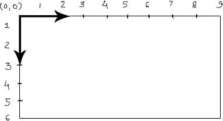

# Intro to p5.js and 2d primitives 

This residency, you will work with [p5.js](http://p5js.org), a JavaScript toolkit for coding digital art, based on the [Processing](http://processing.org) programming environment. 

p5.js is remarkable because it runs *right in your web browser*. Through p5, you will learn the conventions of JavaScript, one of the core languages of the web and one of the most common languages used by developers today.


## Getting Started

###### See McCarthy, Ch 2

Our reference book will walk you through getting up and running with p5.js and the p5.js Editor (or another code editor).


## 2D Coordinate Plane

In p5, the drawing canvas is a 2D coordinate plane. This lets you draw and animate shapes with single-pixel accuracy.

The top left point of the canvas is (0,0). 

Distance is measured in pixels on an **x-axis** (moving to the right) and **y-axis** (moving down).



Shapes are drawn using (x,y) coordinates.


## Shapes, Colors, Fill, and Stroke

###### See McCarthy, Ch 3


## Interaction Preview: mouseX and mouseY

While a static (unmoving) shape can be drawn by manually entering coordinates...

```
function draw() {
	ellipse(50,50,25,25)
}
```

... a shape can become interactive by using your mouse coordinates as a control variable.

This sketch will cause the circle to follow your mouse:

```
function draw() {
	ellipse(mouseX,mouseY,25,25)
}
```

This sketch, using mouseX and mouseY in place of the *width* and *height* of the circle, will cause the circle to resize depending on your mouse motion

```
function draw() {
	ellipse(0,0,mouseX,mouseY)
}
```


## Debugging JavaScript

###### See McCarthy, Ch 2, p. 13


## Putting your sketch on the web with GitHub Pages

GitHub has some perks. One is that it can host our p5 sketches on the web!

* In the GitHub App, open your personal repository for this class.
* On the top bar, find the branch icon: 

   

* Create a new branch that is called `gh-pages`. It **must** be called `gh-pages`, no other name will do.
* GitHub will automatically turn your `gh-pages` branch into a hosted website.
* Your sketch is now online at: `http://yourusername.github.io/reponame/foldername/`
* In class we will walk through replacing each of the parts of that URL with your specific username, repo name, and sketch path.


## Reference

###### McCarthy, Ch 2 (First Sketch) and 3 (Shapes and Colors)


## Assignment

- Commit an original sketch to GitHub.
- Complete the Day 1 Exercise on debugging.